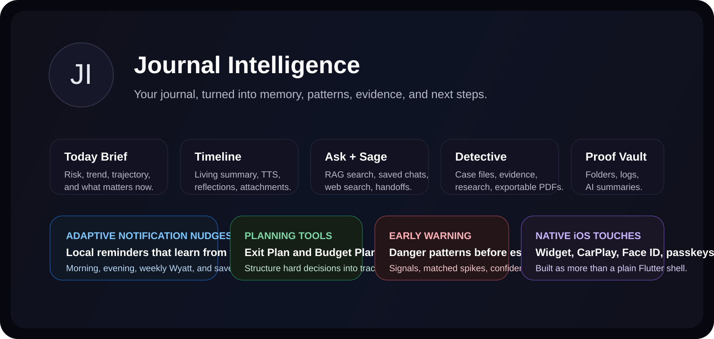
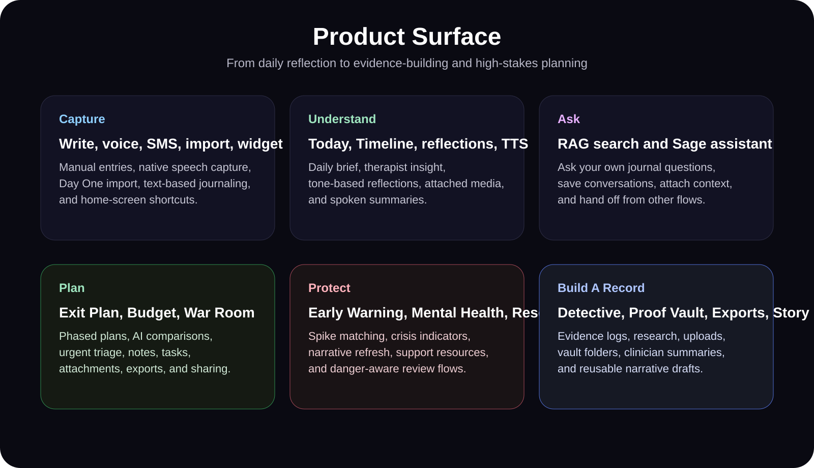
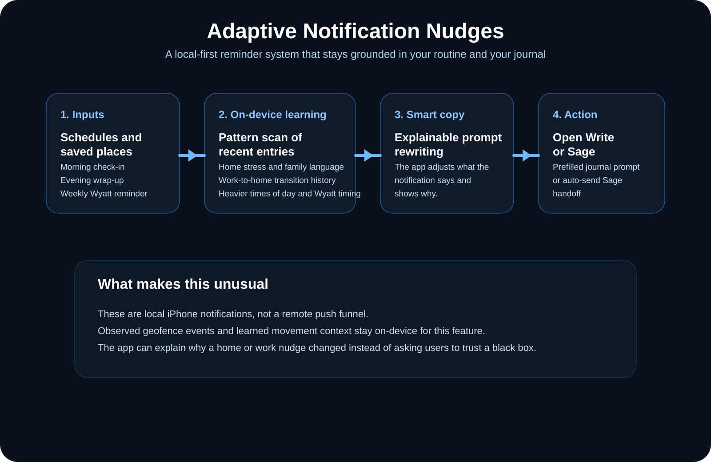

# Journal Intelligence iOS

  

  iOS-first journal intelligence for reflection, pattern detection, case-building, safety planning, and AI-assisted memory.

  

Journal Intelligence is not just a journaling app. It is a private, self-hosted personal intelligence system that helps turn raw entries into usable insight, searchable memory, structured evidence, and concrete next steps.

This Flutter iOS client connects to `https://journal.williamthomas.name` and combines Liquid Glass UI, native iOS integrations, local-first notification logic, and a broad set of specialized AI workflows for daily reflection, high-stakes documentation, and long-horizon planning.

## Why This App Exists

- Capture what happened before it gets lost, whether that starts as writing, speech, SMS, a widget tap, or a CarPlay launch.
- Turn journal history into something usable with daily briefs, timeline insight, semantic search, per-entry reflections, and long-form assistant chat.
- Support real-life decision making with dedicated tools for early warning, mental health tracking, fairness analysis, evidence collection, budgeting, exit planning, and narrative drafting.
- Keep sensitive workflows grounded in iOS-native behavior with Face ID, passkeys, 2FA, session controls, local notifications, and native speech support.

## Product Tour

  

### Core journaling and memory capture

- `Write` is the fast path for manual journaling, with deep links, notification prefills, and native voice-entry hooks.
- `Timeline` is the living record: paginated entries, AI summaries on tiles, edit/delete flows, bookmarks, reflections, and image attachments.
- `Timeline` now also acts like an insight console: it can pull the best cached therapist-insight card for the preferred tone, fall back across multiple tones when needed, regenerate the summary on demand, read it aloud with chunked TTS playback, and hand the full thread straight into Sage for follow-up.
- `Today` generates a daily brief with emotional state, risk, trajectory, trends, and what matters most right now.
- `Ask My Journal` is a journal-wide RAG search experience that answers questions against your own entries and shows supporting matches.
- `Sage` is the persistent assistant experience with journal context, optional web search, saved conversations, attachments, route-based handoff flows, file review, image review, and track-aware coaching memory.
- `Day One` import is built into onboarding so existing journal history can be brought forward instead of starting from zero.
- `SMS journaling` support lets the account verify a phone number and use text-based intake flows from the same system.

### AI reflection and analysis

- Timeline insight uses the therapist insight backend to generate a living summary of recent entries, with cache-aware refresh behavior.
- Entry reflections support six tones: `therapist`, `detective`, `coach`, `friend`, `philosopher`, and `chaos_agent`.
- Timeline insight supports multiple summary voices: `therapist`, `best_friend`, `coach`, `mentor`, `inner_critic`, and `chaos_agent`.
- Timeline can continue directly into Sage with a trimmed, reliability-safe living-summary handoff so the next chat starts from the current emotional and narrative context.
- Text-to-speech playback can read the timeline summary out loud using saved voice settings, chunked audio generation, and native iOS playback handling.
- People intelligence, mood trend data, rollups, contradictions, and pattern alerts are all part of the backend surface this client is wired to.
- Sage can ingest supported files and images inside chat, including plain text formats, PDFs, `.docx`, `.odt`, markdown, structured text, and common image formats, then use that material as part of the active conversation.

### Sage focus tracks

- Focus tracks are persistent coaching threads that help Sage remember what you are working on across sessions instead of treating every chat like a blank slate.
- Each track stores a `title`, `category`, `current goal`, `why this matters`, `next commitment`, `recent wins`, `stuck points`, `open loops`, `success markers`, `status`, and a check-in cadence.
- Built-in categories include `Breakup`, `Custody`, `Burnout`, `Finances`, `Sobriety`, `Leaving`, and `General`.
- Check-in cadence can be `Daily`, `Weekly`, or `When I Open Sage`, depending on how active or lightweight you want the thread to feel.
- Tracks can be marked as the primary track, paused, resumed, archived, or deleted, and Sage can mute a track for a single chat when you want a conversation to stay separate.
- Track check-ins capture what happened, mood, progress status, the win, the hard part, the next step, and whether the user confirmed the entry, giving Sage an ongoing record of momentum and friction instead of a single snapshot.
- When a track is active for the session, Sage injects that goal, the recent wins, stuck points, open loops, next commitment, cadence, and last check-in directly into the chat context.

### Specialized workspaces

- `Detective Mode` turns journal material into case files with evidence logs, photos, uploads, research, AI intelligence refresh, chat sessions, compressed summaries, and PDF export.
- `Early Warning` watches for recurring danger patterns, matched spikes, signal confidence, active people/topics/keywords, and allows dismissal or rebuild.
- `My Mental Health` focuses on mood trends, averages, crisis indicators, and refreshed narrative interpretation.
- `Fairness Ledger` tracks recurring tasks, manual contributions, work-share distribution, and AI-generated fairness summaries.
- `Proof Vault` organizes folders, dated proof items, quick logs, file attachments, and cached or regenerated vault summaries.
- `Exit Plan` supports phased planning, tasks, notes, attachments, exports, share tokens, and structured life-change roadmapping.
- `Budget Planner` stores plans, runs AI comparisons, and exports financial comparisons.
- `My Story` assembles a reusable narrative draft from journal history, case files, and user context.
- `War Room` gives a triage-oriented action space for urgent decisions.
- `Exports` can generate purpose-built packets such as `Weekly Digest`, `Incident Packet`, `Pattern Report`, `Therapy Summary`, and `Facts Chronology`.

### Adaptive notification nudges

  

This is one of the most distinctive parts of the app and it deserves more than a one-line mention.

- Notification nudges are local iPhone notifications, not a generic push campaign.
- The app supports scheduled morning, evening, and weekly Wyatt reminders.
- It also supports saved-place geofence nudges for arrival and exit transitions like `home`, `work`, and other custom places.
- Nudges can deep-link straight into `Write` with a prefilled prompt or into `Sage` with an auto-send handoff.
- The system stores notification settings and observed location-trigger events on-device.
- When explainable journal-pattern prompts are enabled, the app analyzes recent timeline entries locally, looks for signals like home stress, work-to-home transitions, family language, later-day Wyatt mentions, and heavier stress windows, then rewrites notification copy to fit that pattern.
- The UI explains why a nudge became smarter instead of hiding the reasoning behind a black box.
- Location history and learned movement patterns stay on-device for this feature, and the reminders work without APNs.

## iOS-Native Experience

- Liquid Glass-style navigation and surfaces via `adaptive_platform_ui`.
- Native speech recognition service bridged into Flutter for voice capture.
- Home screen Quick Entry widget with shortcuts into `Write`, `Today`, and `Sage`.
- CarPlay launcher with routes for `Companion`, `Voice Entry`, `Briefing`, `Today`, `Ask Sage`, and `Detective`.
- Deep-link and launch-intent routing for flows like `/today`, `/timeline`, `/write`, `/ask`, `/sage`, `/detective`, `/settings`, `/carplay`, `/budget`, `/resources`, and `/notification-nudges`.
- Invite-token access flows for shared or gated entry points.

## Security And Privacy

- Access tokens are kept in memory.
- Refresh uses an HttpOnly cookie managed by `CookieJar`.
- Login supports username/password, TOTP-based 2FA, backup codes, passkey authentication, and Face ID or Touch ID convenience sign-in.
- Recovery questions, session management, password change, and AI-provider configuration all live in the app.
- All authenticated API calls go through `lib/services/api_service.dart`.
- This repo is a client for a self-hosted system rather than a generic SaaS journaling front end.

## Main App Areas

The primary shell is a five-tab `AdaptiveScaffold`:

- `Today`
- `Timeline`
- `Write`
- `Intelligence`
- `More`

The `More` hub expands into the broader product surface:

- `Sage`
- `Ask My Journal`
- `Detective Mode`
- `Exit Plan`
- `Fairness Ledger`
- `My Mental Health`
- `My Story`
- `War Room`
- `Proof Vault`
- `Exports`
- `Early Warning`
- `Budget Planner`
- `Resources`
- `Settings`
- `Admin`

## Repo Highlights

- `lib/screens/` contains the app surface, including feature-heavy screens like `detective_case_screen.dart`, `exit_plan_screen.dart`, `notification_nudges_screen.dart`, `proof_vault_screen.dart`, and `timeline_screen.dart`.
- `lib/services/api_service.dart` is the source of truth for backend communication, auth refresh, uploads, exports, Sage, voice, invite access, and all feature APIs.
- `lib/services/notification_nudge_service.dart` contains the local-first adaptive notification system.
- `lib/providers/auth_provider.dart` and `lib/providers/launch_intent_provider.dart` handle auth state and route-driven launches.
- `ios/Runner/` contains the native speech, notification, launch-route, and CarPlay bridge code.
- `ios/JournalQuickEntryWidget/` contains the home-screen widget extension.

## Tech Stack

- Flutter and Dart
- Native iOS Swift integrations
- `adaptive_platform_ui`
- `provider`
- `dio`, `cookie_jar`, `dio_cookie_manager`
- `flutter_secure_storage`
- `shared_preferences`
- `local_auth`
- `flutter_markdown`
- `audioplayers`
- `image_picker`, `file_picker`, `archive`, `image`
- `share_plus`, `path_provider`, `syncfusion_flutter_pdf`

## Current Gaps In This Client

These features are present in the hub but still route to placeholder views in this repo:

- `Contradictions`
- `Nervous System`
- `Patterns`
- `People Map`
- `People & Topics`

## Development Notes

- Source-of-truth project instructions live in `codex/Project Instructions/`.
- API usage should always be checked against `API_REFERENCE.md` and `ROUTE_MAP.md`.
- Timeline summary behavior is documented in `timeline_master_summary_contract.md`.
- The app is iOS-first, but the Flutter Android scaffold is still present in the repo.
